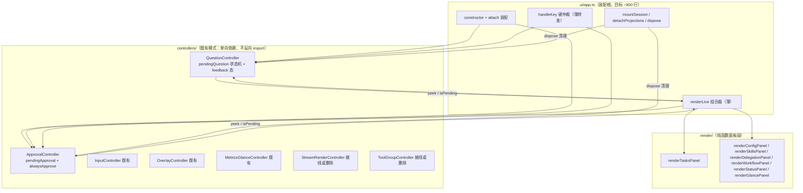

# DSH TUI Split Plan — C4 (app.ts monolith decomposition)

English | [中文](dsh-tui-拆分方案-c4.zh.md)

> **Label**: C4 (4th installment of the DSH TUI enhancement series; C1 benchmarks Claude Code, C2 benchmarks grok-build, C3 delivers four enhancements, C4 is the architecture refactor) **Date**: 2026-08-11 **Scope**: split `packages/tui/tui/src/ui/app.ts` (a 73KB / 1727-line monolith) into controller + pure-function panel modules **Prerequisites**: the four C3 items are committed (30f8897/0c720e2/b1e7f27/277657e/c97e119); test baseline 1191 green (measured 1190/1191 on 2026-08-11)

## Distilled requirements

**User's words**: "The goal of the next stage is to split APP.TS first, so we need a plan. How to split it needs a holistic assessment" "Land the plan as a document first"

**Goal**: split `packages/tui/tui/src/ui/app.ts` into a maintainable module set, with `TuiApp` reduced to a composition root (target ~900 lines). Constraints:
- **Zero behavior change**: app.spec.ts is fully black-box (~100 call sites of `new TuiApp({ctx, stdout, stdin})`, zero references to private state); after the split, **app.spec.ts changes no imports, changes no construction, and stays fully green**
- New modules reuse the existing pattern: the engine/ controller pattern (one-way dependency, never importing app.ts back)
- Fix pre-existing defects inside the split area in passing (5 disposers never released, pendingApproval lingering across sessions, duplicated orphan-controller logic) without widening scope

**Non-goals**: table-driven key routing for handleKey (left as an optional Wave 3 item; this plan does not commit to it); no new dependencies; no splitting of the cordis event vocabulary; no touching agent-loop/session/theme/format/adapter; C3 item 3's rewind assembly layer is out of scope (separate batch); renderLive is not fully converted to pure functions (only the 7 panel segments are extracted).

## Current-state assessment (measured by the 2026-08-11 reconnaissance)

### app.ts structure

The TuiApp class spans L256-1725, with 44 instance fields / 30 private methods / 9 public methods. Line distribution:

| Block | Line range | Lines | Notes |
|---|---|---|---|
| import + type region | L1-226 | ~226 | Question-domain-only: projectQuestionPanel/QuestionRequestInput/UserInteractionError (L64-65/L169); approval-domain-only: formatPermissionDiff (L158)/CallId (L160)/PendingApprovalRequest (L189-196) — can move with their modules |
| constructor | L370-506 | ~137 | injects 8 panel/session closures and self-registers 5 slash commands |
| **renderLive** | L1473-1666 | **~194** | reads ~25 this.* fields (five groups: control plane / state machines / panel visibility / projection sources / input line); taskNotice null-after-render side effect (L1570-1573) |
| **handleKey** | L1212-1382 | **~171** | arbitrates 7+ domains: overlay/palette/search/pendingQuestion/feedbackMode/pendingApproval/input line/exit/abort/steer/editor/Tab |
| mountSession | L763-880 | ~118 | session mounting + wiring of 5 event kinds + delegation-tree prefetch + history replay |
| detachProjections | L1668-1702 | ~35 | unmounts the session; **does not clear the pending approval** (pre-existing defect) |

### Pending state machines (primary split target)

- **pendingQuestion**: fields at L333-339 (including `questionFeedbackMode` L339); lifecycle handleQuestionRequest (L586 suspends + `setEscapeImmediate(true)`, preserving ESC semantics) → settleQuestion (L603)/cancelQuestion (L615), with every call site in handleKey (feedback Enter L1272 / digit keys L1286 / Esc+C L1283); **dispose (L1704-1721) does not settle the pending question, and interactionDisposer is never released in dispose** (grep Disposer, 24 hits, proves the gap).
- **pendingApproval**: fields at L508-513 (including `alwaysApprove` L341); attach at L547 subscribes `approval/request` → handleApprovalRequest (L1099 suspends; alwaysApprove short-circuits to approve; non-current-session requests delegate to `next()`) → settleApproval (L1120); handleKey L1292-1298 consumes y/N/Ctrl+C; **detachProjections does not clear the pending approval — after switching sessions the stale approval can still be settled with y/N and blocks the new session's requests** (pre-existing defect).

### Existing controller pattern (target shape for the split)

- Of the 5 controllers, 3 are already assembled: `new InputController()` (app.ts L418, no arguments), `MetricsGlanceController` (L499-503, throttleMs:0), `OverlayController` (L555-560, injected with live + onOverlayChange) — none of them **imports app.ts back** (one-way dependency).
- **2 orphans**: StreamRenderController and ToolGroupController are extracted and tested but have no production consumer; app.ts still inlines isomorphic logic — `handleStreamEvent` (app.ts L1419-1440) vs stream-render-controller L73-94, and the live tool card (app.ts L1620-1627) vs tool-group-controller L71-108. **Duplicated-logic risk**: a future change edits only one copy → divergent behavior.
- OverlaySystem carries only the 3 full-screen overlays (command-palette/keymap/search, registered at app.ts L561-568); the skill/config/delegation/workflow/status panels are **not overlays** — they are live-region panels inlined in renderLive (boolean visibility bits + pure projection functions, such as the `projectStatusPanel` import at L51-52).
- Render scheduling is dual-driven — a 120ms ticker (L570) + synchronous WriteBatcher.flushNow passthrough (flushLiveRender L1468); resize/event handlers call flushLiveRender or renderBatcher.schedule().

### Test coverage (the split's safety net)

- app.spec.ts is fully black-box: `new TuiApp` + self-built mocks makeCtx/makeStdout/makeStdin/makeAgent/makeHandle; 40 describes (L143-L3108) cover every domain; zero `pendingQuestion|pendingApproval` literals (grep proves absence); only 2 bracket accesses to private members (L1952 slash, L3104 modelRef), neither in the question/approval domains.
- Question tests: capture the userInteraction provider → `provider().ask()` → settle via stdin.emit key bytes (describe T3.1 L2222); approval tests: pull the approval/request handler from ctx.on.mock.calls and call it directly → settle via key bytes (Phase 8 L605/L619).

## Root causes

app.ts did not reach 1727 lines from a single cause; three forces compounded:

1. **State machines coupled to rendering**: for pendingQuestion/pendingApproval, the four concerns of suspending, settling, rendering, and key arbitration are scattered across four methods (handleQuestionRequest/settleQuestion/handleKey/renderLive) — state lives in fields, behavior in methods, presentation in renderLive branches — with no object boundary among the three, so any new interaction touches all four places at once.
2. **Inlined panel rendering**: the 7 live-region panels (tasks/config/skills/delegation/workflow/status/glance) sit inside renderLive as "boolean visibility bit + inline projection call", even though each panel's projection function is already an independent pure function (projectXxxPanel) — the render composition layer was never extracted, so renderLive grows with every added panel.
3. **Extraction without wiring**: two controllers (StreamRender/ToolGroup) were extracted historically but never wired in, leaving a "half-extracted" intermediate state that duplicates the inline logic — evidence that the extraction step lacked a "wire in or delete" closing discipline.

## Target architecture

Dependency direction: `app.ts → controllers →（无反向）`; `app.ts → render/ 纯函数`; controllers hold only state and callbacks (no importing app.ts, no touching rendering). The 3 existing controllers stay as they are.

## Alternatives and trade-offs

| Option | Pros | Cons | Verdict |
|---|---|---|---|
| A: extract the state machines into controller classes (QuestionController/ApprovalController) | aligns with the existing InputController/OverlayController pattern; zero black-box test changes; state and behavior cohere | app.ts must keep the provider registration and a thin key-routing forwarder | ✓ (Wave 1) |
| B: split the class via mixins/composition (TuiApp inherits multiple mixins) | field relocation is mechanical | implicitly shared this breaks encapsulation; inconsistent with the existing controller pattern | — |
| C: make renderLive fully pure (snapshot → output) | rendering becomes fully testable | snapshotting 25 fields is costly; the taskNotice side effect must be made explicit; this plan extracts only the 7 panel segments | partially adopted (Wave 2) |
| D: table-driven key routing for handleKey | declarative arbitration logic | the 7 domains' arbitration is mutually interleaved; tabling it is high risk, low reward | non-goal (optional Wave 3) |

## Planned changes

### Wave 1: state machines into controllers (main split, behavior unchanged)

| # | Task | Files | Proposal |
|---|---|---|---|
| 1 | Create QuestionController | `packages/tui/tui/src/controllers/question-controller.ts` (new) | Extract the pendingQuestion state machine + questionFeedbackMode from app.ts L333-339/L586-630. Interface: `ask(request): Promise<unknown>` (suspends, storing the resolve/reject handles), `settle(answer)`, `cancel()`, `peek(): QuestionPeek | null`, `isPending`, `feedbackMode`; constructor injects an `onEscapeImmediate(flag: boolean)` callback (preserving pending-state ESC semantics) |
| 2 | Create ApprovalController | `packages/tui/tui/src/controllers/approval-controller.ts` (new) | Extract pendingApproval + alwaysApprove from app.ts L508-513/L1099-1140. Interface: `handle(request, next): Promise<ApprovalOutcome>` (with the alwaysApprove short-circuit + non-current-session delegation to next()), `settle(outcome)`, `peek(): ApprovalPeek | null`, `isPending`, `setAlwaysApprove(flag)`; constructor injects a `getCurrentSessionId()` getter |
| 3 | Replace app.ts internals with forwarding | `packages/tui/tui/src/ui/app.ts` | Fields become controller instances (new-ed at attach); handleQuestionRequest/settleQuestion/cancelQuestion/handleApprovalRequest/settleApproval thin down to controller calls; the userInteraction provider registration (L575-585) and the approval/request subscription (L547) stay in app (assembly responsibility); single-domain imports (projectQuestionPanel/formatPermissionDiff/UserInteractionError/CallId) move into the controller files |
| 4 | handleKey pending-state branches read the controllers | app.ts L1283-1298 | `question.isPending`/`approval.isPending` decide branch entry; settlement calls controller methods (feedback Enter/digit keys/Esc → question.settle/cancel; y/N/Ctrl+C → approval.settle) |
| 5 | renderLive pending-state segments read peek | app.ts L1563-1603 | `question.peek()`/`approval.peek()` return snapshots (question/options/feedbackMode; approval payload/diff lines) |
| 6 | Fix pre-existing defects in passing | app.ts dispose/detachProjections | dispose adds the `interactionDisposer()` release + rejects the pending question (prevents callback leaks); detachProjections adds cancelled settlement of pendingApproval (fixes the cross-session lingering) — write reproducing tests RED first |
| 7 | Unit tests for the new controllers | `packages/tui/tui/tests/question-controller.spec.ts`, `approval-controller.spec.ts` (new) | suspend/settle/feedback custom/cancel/alwaysApprove short-circuit/non-current-session delegation to next() |

### Wave 2: renderLive panel segments into pure functions

| # | Task | Files | Proposal |
|---|---|---|---|
| 8 | Define LiveSnapshot | `packages/tui/tui/src/render/live-snapshot.ts` (new) | Type for the field subset renderLive reads (control plane / state machines / panel visibility / projection sources / input line, ~25 fields), extracted from the app.ts field declarations |
| 9 | Make the 7 panel segments pure functions | `packages/tui/tui/src/render/live-panels.ts` (new) | One `(snapshot) => RenderedRow[]` per panel: renderTasksPanel/renderConfigPanel/renderSkillsPanel/renderDelegationPanel/renderWorkflowPanel/renderStatusPanel/renderGlancePanel; move single-domain imports along (formatToolCardLive etc.) |
| 10 | renderLive becomes a composer | app.ts L1473-1666 | Assemble the snapshot → call each segment's pure function → merge; make the taskNotice null-after-render side effect explicit (return `{ rows, noticeConsumed }`) |
| 11 | Unit tests for the panel segments | `packages/tui/tui/tests/live-panels.spec.ts` (new) | Per panel: input snapshot → assert row output |

### Wave 3: closing cleanup

| # | Task | Files | Proposal |
|---|---|---|---|
| 12 | dispose releases all 5 disposers | app.ts dispose | Explicitly release interaction/subagent/workflow/taskDone/taskSurface (currently only approval/projection are released); new test: after dispose, calling registerProvider again does not throw DUPLICATE_PROVIDER |
| 13 | Decide the orphan controllers | app.ts + engine/stream-render-controller.ts + engine/tool-group-controller.ts | Compare case by case: app.ts L1419-1440 vs stream-render-controller L73-94, app.ts L1620-1627 vs tool-group-controller L71-108 — wire in (replace the inline logic with controller calls) or delete the extraction (keep the inline logic); **leave no third orphan**; pick one of the two on isomorphism evidence |
| 14 | Sync the docs | `packages/tui/tui/docs/projection-layer.md` or a new docs/tui-controllers.md | Add the controllers/ layering description and dependency direction |

## Verification checklist

- After Wave 1 lands, `app.spec.ts` is fully green with **0 changes** (black box unbroken) — the strongest behavior-equivalence criterion
- New controller unit tests green: question suspend/settle/feedback custom/cancel; approval short-circuit/delegation/settlement
- Reproducing test for the pendingApproval cross-session lingering: attach session A with a pending approval → switch to session B → the stale approval can no longer be settled (RED → GREEN)
- dispose leak test: re-registering the provider after dispose does not throw DUPLICATE_PROVIDER
- After Wave 2 lands, renderLive output matches the baseline (the black-box spec covers render output)
- At the end of each wave, `NO_COLOR=1 pnpm vitest run packages/tui/tui/tests/` fully green + `pnpm exec tsc -b packages/tui/tui` passes
- Manual checkpoint: app.ts drops from 1727 lines to ~900-1100 (after Wave 1+2)

## Yaoguang counter-evidence (planning-time reproduction)

| Assertion | Evidence type | Evidence |
|---|---|---|
| app.spec.ts references zero pendingQuestion/pendingApproval literals | planning-time grep | `grep 'pendingQuestion\|pendingApproval' tests/app.spec.ts` → 0 matches (2026-08-11) |
| Question-domain imports are single-domain and movable | planning-time read | app.ts L64-65 (projectQuestionPanel/QuestionRequestInput), L169 (UserInteractionError) used only by the question domain |
| Approval-domain imports are single-domain and movable | planning-time read | app.ts L158 (formatPermissionDiff), L160 (CallId), L189-196 (PendingApprovalRequest/ApprovalOutcome) |
| 5 disposers have no release point in the dispose section | planning-time grep | `grep Disposer` app.ts 24 hits; dispose L1704-1721 references only approvalDisposer (L1712-1713)/projectionDisposer (L1675-1676) |
| pendingApproval lingers across sessions (detachProjections does not clear it) | planning-time read | detachProjections L1668-1702 has no pendingApproval reference; the approval subscription is in attach L547 (session-level) |
| renderLive's ~194 lines read ~25 fields | planning-time read | app.ts L1473-1666 (scout batch:0 line count + main-agent confirmation) |
| Orphan controllers have no production consumer | planning-time grep | `grep 'StreamRenderController\|ToolGroupController'` in src/ hits only their own definition files and tests |
| Black-box tests construct ~100 new TuiApp | planning-time grep | `grep 'new TuiApp('` tests/app.spec.ts L151-L3128, about 100 sites |

**Hypotheses to verify** (verified as the first step of execution):
- after snapshotting, renderLive output under the 120ms ticker matches today's — relies on black-box spec coverage; corners the spec does not cover are marked "unverified";
- after the question-controller extraction, `setEscapeImmediate` timing is unchanged — confirm at execution time that the existing Esc tests cover it; if there is no "keypress immediately after Esc" case, add one;
- the orphan controllers are isomorphic case by case (batch:1 already did a first comparison finding isomorphism) — before wiring in, use both sides' tests as the criterion; if any case's semantics differ, the app.ts inline logic wins (delete the extraction).

## Regression checklist (behavior-equivalence anchors for the refactor)

Functional anchors that exist before the change and must still exist after it (check item by item before delivery; each carries its verification method):

| # | Anchor | Verification |
|---|---|---|
| 1 | `new TuiApp({ctx, stdout, stdin, ...})` construction signature unchanged (~100 spec call sites) | grep `new TuiApp(` count does not drop; app.spec.ts has 0 changes |
| 2 | Digit keys 1-9 select question options; Esc/Ctrl+C cancels the question | app.spec T3.1 describe (L2222) fully green |
| 3 | `f` enters feedback mode, Enter submits custom, Esc exits feedback | app.spec L2293/L2319 ('f' key) fully green |
| 4 | Approval y/N/Ctrl+C settlement; alwaysApprove short-circuits to approve | app.spec Phase 8 describes (L605/L619) fully green |
| 5 | setEscapeImmediate(true) while a question is pending (ESC not a CSI prefix) | input-handler Esc tests + pending-state keypress cases |
| 6 | Session switching (mountSession/detachProjections) event wiring and projection reset | app.spec session-switch describes fully green |
| 7 | renderLive renders the 7 panels + pending-state cards (output lines contain 🧭/❓/approval diff) | app.spec render-assertion describes fully green |
| 8 | dispose releases the approval/projection disposers (existing behavior) | existing dispose tests fully green |
| 9 | Slash commands (/fork /model etc.) still dispatch through the registry | app.spec slash describe (L1952) fully green |
| 10 | Ctrl+P/Ctrl+./Ctrl+F overlay toggles and search state | app.spec overlay/search describes fully green |

## Risks and decision points

- **Another session is winding down tests** (10 modified, uncommitted, in the workspace): reconcile git status before executing; start Wave 1 only after that work is committed.
- **handleKey stays put**: arbitration remains in app.ts (thin forwarding); table-driven key routing is an explicit non-goal — this bounds Wave 1 risk.
- **Orphan-controller decision point** (Wave 3 #13): wiring in vs deleting is decided at execution time on isomorphism evidence; this plan does not predecide.
- **Performance**: controller-izing adds zero overhead (pure state relocation); after the renderLive split, the snapshot is assembled once per tick (same as today).
- **Test file placement**: the new tests/question-controller.spec.ts etc. are standalone files, not merged into app.spec.ts (keeps the black-box boundary clean).

## Follow-ups (separate batches, not part of this split)

1. Table-driven key routing for handleKey (promotable to a C5 candidate if Wave 3 goes smoothly)
2. **Tab @-completion flake attribution (not a regression)**: `git ls-files` 500ms timeout + `tabComplete` not forwarding `timeoutMs`, doubly environment-dependent on cwd and parallel load — pre-existing. Recommend threading `timeoutMs` from `getCompletions` through `resolveFileCompletion` → `tabComplete` → `handleTabComplete` into the completion domain so high-load CI environments can tune it. Current chain: `app.ts:1214` → `input-controller.ts:53` → `file-completer.ts:91` → `file-completer.ts:37`; only the last level, `getCompletions`, accepts `timeoutMs` (default `GIT_LS_FILES_TIMEOUT_MS=500`); every level above hardcodes not passing it.
3. C3 item 3's rewind assembly layer (trackEdit hook injection + SessionStore.truncate + rewind overlay)
4. Decide on the contradiction between the package.json description ("scaffold; tui-render-core") and reality (update the description or plan the render-core package split)

## Delivery status (2026-08-11, four waves delivered)

**Delivery commit chain** (all landed; local branch ahead of origin):

| Commit | Wave | Content | Stats (measured via git numstat) |
|---|---|---|---|
| `a603ada` | Wave 1 | QuestionController/ApprovalController extraction + unit tests | +602 (2 controllers 253 + live-snapshot 104 + 2 specs 245) |
| `6cd01db` | Wave 2+3 | renderLive panel-segment extraction: live-panels with 7 pure-function panels + renderLive turned composer + live-panels.spec + tui-controllers.md | app.ts **+155/−218** (net −63); live-panels 155, spec 240, doc 56 |
| `a8ff778` | Wave 3 | Orphan StreamRender/ToolGroup deleted (isomorphism comparison found unequal semantics) | +0/−725 (4 files) |
| `abccfde` | Wave 3 closing | taskDone/taskSurface disposer release + RED regression tests + subscription-ledger balance assertion | app.ts +12; app.spec +71/−2 (total +83) |

**Review verdict** (against this plan's 14 tasks): all landed. The black-box criterion holds — app.spec.ts had zero changes across the first three waves' commits (`abccfde`'s +71 is the new regression tests and ledger assertions that plan item 12 requires; the black box is unbroken: no import changes, no construction changes). dispose/detachProjections release the 5 disposer kinds (interaction/subagent/workflow×5/taskDone/taskSurface) and settle the pending question (reject ASK_CANCELLED) and the pending approval (cancelled), with the subscription-ledger assertion as the backstop. The orphan-deletion criterion holds: StreamRender lacks the three fluency cases and ToolGroup lacks the compact parameter — semantics unequal → the extraction is deleted (the underlying primitives are kept).

**Two review findings**: ① the Wave 1 commit (`a603ada`) only added the controllers without wiring app.ts — the inline state machines and the new controllers coexisted within one commit (self-creating exactly the "extracted but unwired" orphan intermediate state), eliminated when Wave 2 wired them in; a process blemish with no functional impact. ② the app.ts line-count target was missed — the split's measured starting point was 1831 lines (a72e7b8; 1727 was the reconnaissance figure when this plan was drafted, and C3 features had since added back ~104 lines), and after the four waves HEAD is at 1780 lines (net −51). The migrated renderLive panel segments and the two pending state machines (~284 lines of logic) are now carried by controllers/live-panels; the line count did not fall because of the later features and comments — the remaining composition (field region ~260, session business methods ~300, handleKey 176, renderLive non-panel segments ~120, mountSession 130) is a C5 candidate (see item 1 under "Follow-ups").

**Final verification** (supervisor's real runs + re-check): `packages/tui/tui/tests/` 66 files; full run **1225 passed + 2 todo, all green** (three real runs on 2026-08-11: 1222/1224/1225 passed; the occasional 1–2 @-completion failures are all the git ls-files concurrency-timeout flake and pass in isolation, see item 2 under "Follow-ups"); `tsc -b tsconfig.host.json` exit 0 (finished within timeout 240); lefthook pre-commit all passed (self-evidenced by the 4 commits landing). All 10 anchors in the checklist above are preserved.
