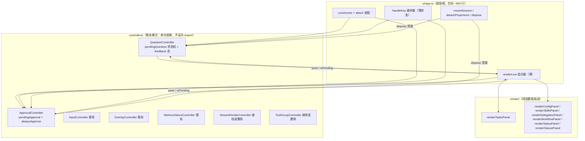

# DSH TUI 拆分方案 — C4（app.ts 单体拆解）

[English](dsh-tui-拆分方案-c4.md) | 中文

> **标记**：C4（DSH TUI 增强系列第 4 份；C1 对标 Claude Code、C2 对标 grok-build、C3 四项增强、C4 架构重构）**日期**：2026-08-11 **范围**：拆分 `packages/tui/tui/src/ui/app.ts`（73KB / 1727 行单体）为 controller + 纯函数面板模块**前置**：C3 四项已提交（30f8897/0c720e2/b1e7f27/277657e/c97e119）；测试基线 1191 条绿（2026-08-11 实测 1190/1191）

## 需求提炼

**用户原话**：「下一阶段我们目标是先拆 APP.TS 所以要出计划。怎么拆 需要整体评估」「先把计划落地文档」

**目标**：把 `packages/tui/tui/src/ui/app.ts` 拆分为可维护模块组，`TuiApp` 退化为装配根（目标 ~900 行）。约束：
- **行为零变化**：app.spec.ts 全黑盒（~100 处 `new TuiApp({ctx, stdout, stdin})`，零引用私有状态），拆分后 **app.spec.ts 不改 import、不改构造方式、全绿**
- 新模块复用既有模式：engine/ controller 模式（单向依赖、不反向 import app.ts）
- 顺手修复拆分区域内的既有缺陷（5 个 disposer 未释放、pendingApproval 跨会话残留、孤儿 controller 逻辑重复），不扩大范围

**非目标**：handleKey 键路由表化（留 Wave 3 可选，本计划不承诺）；不引入新依赖；不拆 cordis 事件词汇；不动 agent-loop/session/theme/format/adapter；不处理 C3 项 3 rewind 装配层（独立批次）；renderLive 不全量纯函数化（只拆 7 个面板段）。

## 现状评估（2026-08-11 侦察实测）

### app.ts 结构

TuiApp 类 L256-1725，44 个实例字段 / 30 个私有方法 / 9 个公开方法。行数分布：

| 块 | 行号区间 | 行数 | 说明 |
|---|---|---|---|
| import + 类型区 | L1-226 | ~226 | 提问域独有：projectQuestionPanel/QuestionRequestInput/UserInteractionError（L64-65/L169）；审批域独有：formatPermissionDiff（L158）/CallId（L160）/PendingApprovalRequest（L189-196）——可随模块搬走 |
| constructor | L370-506 | ~137 | 注入 8 个面板/会话闭包，自注册 5 个 slash 命令 |
| **renderLive** | L1473-1666 | **~194** | 读 ~25 个 this.* 字段（控制面/状态机/面板显隐/投影源/输入行五组）；taskNotice 渲染后置 null 副作用（L1570-1573） |
| **handleKey** | L1212-1382 | **~171** | 仲裁 7+ 域：overlay/palette/search/pendingQuestion/feedbackMode/pendingApproval/输入行/退出/abort/steer/编辑器/Tab |
| mountSession | L763-880 | ~118 | 会话挂载 + 5 类事件接线 + 委派树预取 + 历史重放 |
| detachProjections | L1668-1702 | ~35 | 卸载会话；**不清挂起审批**（既有缺陷） |

### 挂起状态机（拆分主目标）

- **pendingQuestion**：字段 L333-339（含 `questionFeedbackMode` L339）；生命周期 handleQuestionRequest（L586 挂起 + `setEscapeImmediate(true)`，保持 ESC 语义）→ settleQuestion（L603）/cancelQuestion（L615），调用点全在 handleKey（反馈 Enter L1272 / 数字键 L1286 / Esc+C L1283）；**dispose（L1704-1721）不结算挂起提问、interactionDisposer 从未在 dispose 释放**（grep Disposer 24 命中证缺）。
- **pendingApproval**：字段 L508-513（含 `alwaysApprove` L341）；attach L547 订阅 `approval/request` → handleApprovalRequest（L1099 挂起；alwaysApprove 短路放行；非当前会话委托 `next()`）→ settleApproval（L1120）；handleKey L1292-1298 消费 y/N/Ctrl+C；**detachProjections 不清挂起审批——切会话后旧审批仍可被 y/N 结算且阻塞新会话请求**（既有缺陷）。

### 既有 controller 模式（拆分目标形态）

- 5 个 controller 中 3 个已装配：`new InputController()`（app.ts L418，无参）、`MetricsGlanceController`（L499-503，throttleMs:0）、`OverlayController`（L555-560，注入 live + onOverlayChange）——均**不反向 import app.ts**（单向依赖）。
- **2 个孤儿**：StreamRenderController、ToolGroupController 已提取、有测试，但无生产消费者；app.ts 仍内联同构逻辑——`handleStreamEvent`（app.ts L1419-1440）vs stream-render-controller L73-94、live 工具卡（app.ts L1620-1627）vs tool-group-controller L71-108。**逻辑重复风险**：未来修改只改一处 → 行为不一致。
- OverlaySystem 只承载 3 个全屏弹层（command-palette/keymap/search，app.ts L561-568 注册）；skill/config/delegation/workflow/status 面板**不是 overlay**——是 renderLive 内联的 live 区面板（布尔显隐位 + 纯投影函数，如 `projectStatusPanel` L51-52 import）。
- 渲染调度：双驱动——ticker 120ms（L570）+ WriteBatcher.flushNow 同步穿透（flushLiveRender L1468）；resize/事件 handler 调 flushLiveRender 或 renderBatcher.schedule()。

### 测试面（拆分安全网）

- app.spec.ts 全黑盒：`new TuiApp` + makeCtx/makeStdout/makeStdin/makeAgent/makeHandle 自建 mock；40 个 describe（L143-L3108）覆盖全部域；零处 `pendingQuestion|pendingApproval` 字面量（grep 证无）；仅 2 处 bracket 私有访问（L1952 slash、L3104 modelRef），不在提问/审批域。
- 提问测试：捕获 userInteraction provider → `provider().ask()` → stdin.emit 键字节结算（describe T3.1 L2222）；审批测试：从 ctx.on.mock.calls 抽取 approval/request handler 直调 → 键字节结算（Phase 8 L605/L619）。

## 根因

app.ts 的 1727 行不是单一原因造成的，而是三股力量叠加：

1. **状态机与渲染耦合**：pendingQuestion/pendingApproval 的挂起、结算、渲染、键仲裁四件事散在四个方法（handleQuestionRequest/settleQuestion/handleKey/renderLive），状态是字段、行为是方法、展示是 renderLive 里的分支——三者没有对象边界，任何新交互都得同时改四处。
2. **面板渲染内联**：7 个 live 区面板（tasks/config/skills/delegation/workflow/status/glance）以「布尔显隐位 + 内联投影调用」形态躺在 renderLive 里，各自的投影函数却已是独立纯函数（projectXxxPanel）——渲染组合层没有提取，面板越多 renderLive 越长。
3. **提取未接线**：历史上已提取过两个 controller（StreamRender/ToolGroup）但没有接线，留下「提取一半」的中间态，与内联逻辑重复——说明提取动作缺少「接线或删除」的收尾纪律。

## 目标架构

依赖方向：`app.ts → controllers →（无反向）`；`app.ts → render/ 纯函数`；controllers 只持有状态与回调（不 import app.ts、不碰渲染）。既有 3 个 controller 维持现状不动。

## 方案取舍

| 方案 | 优点 | 缺点 | 选择 |
|---|---|---|---|
| A：状态机提取为 controller 类（QuestionController/ApprovalController） | 对齐既有 InputController/OverlayController 模式；黑盒测试零改动；状态与行为内聚 | 需在 app.ts 保留 provider 注册与键路由薄转发 | ✓（Wave 1） |
| B：mixin/composition 拆类（TuiApp 继承多个 mixin） | 字段搬迁机械 | 隐式共享 this 破坏封装；与既有 controller 模式不一致 | — |
| C：renderLive 全量纯函数化（快照 → 输出） | 渲染完全可测 | 25 字段快照化成本高；taskNotice 副作用需显式化；本计划只拆 7 面板段 | 部分采纳（Wave 2） |
| D：handleKey 键路由表驱动 | 仲裁逻辑声明化 | 7 域仲裁互相穿插，表化风险高收益低 | 非目标（Wave 3 可选） |

## 改动面

### Wave 1：状态机 controller 化（主拆分，行为不变）

| # | 任务 | 文件 | 提议 |
|---|---|---|---|
| 1 | 新建 QuestionController | `packages/tui/tui/src/controllers/question-controller.ts`（新增） | 从 app.ts L333-339/L586-630 提取 pendingQuestion 状态机 + questionFeedbackMode。接口：`ask(request): Promise<unknown>`（挂起，存 resolve/reject 句柄）、`settle(answer)`、`cancel()`、`peek(): QuestionPeek | null`、`isPending`、`feedbackMode`；构造注入 `onEscapeImmediate(flag: boolean)` 回调（保持挂起态 ESC 语义） |
| 2 | 新建 ApprovalController | `packages/tui/tui/src/controllers/approval-controller.ts`（新增） | 从 app.ts L508-513/L1099-1140 提取 pendingApproval + alwaysApprove。接口：`handle(request, next): Promise<ApprovalOutcome>`（含 alwaysApprove 短路 + 非当前会话委托 next()）、`settle(outcome)`、`peek(): ApprovalPeek | null`、`isPending`、`setAlwaysApprove(flag)`；构造注入 `getCurrentSessionId()` getter |
| 3 | app.ts 替换为转发 | `packages/tui/tui/src/ui/app.ts` | 字段换 controller 实例（attach 处 new）；handleQuestionRequest/settleQuestion/cancelQuestion/handleApprovalRequest/settleApproval 变薄为 controller 调用；userInteraction provider 注册（L575-585）与 approval/request 订阅（L547）留在 app（装配职责）；单域 import（projectQuestionPanel/formatPermissionDiff/UserInteractionError/CallId）搬进 controller 文件 |
| 4 | handleKey 挂起态分支改读 controller | app.ts L1283-1298 | `question.isPending`/`approval.isPending` 决定分支进入；结算调 controller 方法（反馈 Enter/数字键/Esc → question.settle/cancel；y/N/Ctrl+C → approval.settle） |
| 5 | renderLive 挂起态渲染段改读 peek | app.ts L1563-1603 | `question.peek()`/`approval.peek()` 返回快照（question/options/feedbackMode；approval payload/diff 行） |
| 6 | 顺手修既有缺陷 | app.ts dispose/detachProjections | dispose 补 `interactionDisposer()` 释放 + 挂起提问 reject（防回调泄漏）；detachProjections 补 pendingApproval cancelled 结算（修跨会话残留）——先写复现测试 RED |
| 7 | 新 controller 单测 | `packages/tui/tui/tests/question-controller.spec.ts`、`approval-controller.spec.ts`（新增） | 挂起/结算/反馈 custom/取消/alwaysApprove 短路/非当前会话委托 next() |

### Wave 2：renderLive 面板段拆纯函数

| # | 任务 | 文件 | 提议 |
|---|---|---|---|
| 8 | 定义 LiveSnapshot | `packages/tui/tui/src/render/live-snapshot.ts`（新增） | renderLive 读取字段子集类型（控制面/状态机/面板显隐/投影源/输入行，~25 字段），从 app.ts 字段声明提取 |
| 9 | 7 面板段纯函数化 | `packages/tui/tui/src/render/live-panels.ts`（新增） | 每面板一个 `(snapshot) => RenderedRow[]`：renderTasksPanel/renderConfigPanel/renderSkillsPanel/renderDelegationPanel/renderWorkflowPanel/renderStatusPanel/renderGlancePanel；搬走单域 import（formatToolCardLive 等） |
| 10 | renderLive 变组合器 | app.ts L1473-1666 | 组装 snapshot → 调各段纯函数 → 合并；taskNotice 渲染后置 null 副作用显式化（返回 `{ rows, noticeConsumed }`） |
| 11 | 面板段单测 | `packages/tui/tui/tests/live-panels.spec.ts`（新增） | 每面板：输入快照 → 断言行输出 |

### Wave 3：收尾清理

| # | 任务 | 文件 | 提议 |
|---|---|---|---|
| 12 | dispose 补全 5 个 disposer 释放 | app.ts dispose | interaction/subagent/workflow/taskDone/taskSurface 显式释放（当前仅 approval/projection 释放）；新增测试：dispose 后再次 registerProvider 不抛 DUPLICATE_PROVIDER |
| 13 | 孤儿 controller 决策 | app.ts + engine/stream-render-controller.ts + engine/tool-group-controller.ts | 逐 case 对比 app.ts L1419-1440 vs stream-render-controller L73-94、app.ts L1620-1627 vs tool-group-controller L71-108——接线（替换内联为 controller 调用）或删除提取（保留内联）；**不留第三个孤儿**；按同构性证据二选一 |
| 14 | 文档同步 | `packages/tui/tui/docs/projection-layer.md` 或新增 docs/tui-controllers.md | 补 controllers/ 分层说明与依赖方向 |

## 验证清单

- Wave 1 落地后 `app.spec.ts` **0 改动全绿**（黑盒未破坏）——最强行为等价判据
- 新增 controller 单测绿：question 挂起/结算/反馈 custom/取消；approval 短路/委托/结算
- pendingApproval 跨会话残留复现测试：attach 会话 A 挂起审批 → 切会话 B → 旧审批不可再结算（RED → GREEN）
- dispose 泄漏测试：dispose 后重新注册 provider 不抛 DUPLICATE_PROVIDER
- Wave 2 落地后 renderLive 输出与基线一致（黑盒 spec 覆盖渲染输出）
- 每波结束 `NO_COLOR=1 pnpm vitest run packages/tui/tui/tests/` 全绿 + `pnpm exec tsc -b packages/tui/tui` 通过
- 人工检查点：app.ts 行数从 1727 降至 ~900-1100（Wave 1+2 后）

## 瑶光反证（计划期复现）

| 断言 | 证据类型 | 证据 |
|---|---|---|
| app.spec.ts 零引用 pendingQuestion/pendingApproval 字面量 | 计划期 grep | `grep 'pendingQuestion\|pendingApproval' tests/app.spec.ts` → 0 匹配（2026-08-11） |
| 提问域 import 单域可搬 | 计划期 read | app.ts L64-65（projectQuestionPanel/QuestionRequestInput）、L169（UserInteractionError）仅提问域使用 |
| 审批域 import 单域可搬 | 计划期 read | app.ts L158（formatPermissionDiff）、L160（CallId）、L189-196（PendingApprovalRequest/ApprovalOutcome） |
| 5 个 disposer 在 dispose 段无释放点 | 计划期 grep | `grep Disposer` app.ts 24 命中；dispose L1704-1721 仅引 approvalDisposer（L1712-1713）/projectionDisposer（L1675-1676） |
| pendingApproval 跨会话残留（detachProjections 不清） | 计划期 read | detachProjections L1668-1702 无 pendingApproval 引用；approval 订阅在 attach L547（会话级） |
| renderLive ~194 行读 ~25 字段 | 计划期 read | app.ts L1473-1666（scout batch:0 行数计算 + 主代理确认） |
| 孤儿 controller 无生产消费者 | 计划期 grep | `grep 'StreamRenderController\|ToolGroupController'` src/ 仅命中自身定义文件与测试 |
| 黑盒测试 ~100 处 new TuiApp | 计划期 grep | `grep 'new TuiApp('` tests/app.spec.ts L151-L3128 约 100 处 |

**待验证假设**（执行期第一步验证）：
- renderLive 快照化后 ticker 120ms 渲染输出与现有一致——依赖黑盒 spec 覆盖，spec 未覆盖角落标注「未验证」；
- question-controller 提取后 `setEscapeImmediate` 时序不变——执行时确认现有 Esc 测试覆盖，若无「Esc 后立即按键」用例补一条；
- 孤儿 controller 逐 case 同构（batch:1 已初对比同构）——接线前以双方测试为判据，任何 case 语义不等则以 app.ts 内联为准（删除提取）。

## 回归清单（重构行为等价锚点）

改动前存在、改动后必须仍存在的功能锚点（交付前逐项核对，每项附验证方式）：

| # | 锚点 | 验证方式 |
|---|---|---|
| 1 | `new TuiApp({ctx, stdout, stdin, ...})` 构造签名不变（~100 处 spec 调用） | grep `new TuiApp(` 数量不减；app.spec.ts 0 改动 |
| 2 | 数字键 1-9 选提问选项、Esc/Ctrl+C 取消提问 | app.spec T3.1 describe（L2222）全绿 |
| 3 | `f` 键进反馈模式、Enter 提交 custom、Esc 退出反馈 | app.spec L2293/L2319（'f' 键）全绿 |
| 4 | 审批 y/N/Ctrl+C 结算、alwaysApprove 短路放行 | app.spec Phase 8 describe（L605/L619）全绿 |
| 5 | 挂起提问期间 setEscapeImmediate(true)（ESC 非 CSI 前缀） | input-handler Esc 测试 + 挂起态按键用例 |
| 6 | 切会话（mountSession/detachProjections）事件接线与投影重置 | app.spec 会话切换 describe 全绿 |
| 7 | renderLive 渲染 7 面板 + 挂起态卡片（输出行含 🧭/❓/审批 diff） | app.spec 渲染断言 describe 全绿 |
| 8 | dispose 释放 approval/projection disposer（既有行为） | 现有 dispose 测试全绿 |
| 9 | slash 命令（/fork /model 等）经 registry 分发不变 | app.spec slash describe（L1952）全绿 |
| 10 | Ctrl+P/Ctrl+./Ctrl+F overlay 开关与搜索态 | app.spec overlay/search describe 全绿 |

## 风险与决策点

- **另一个会话正在收束测试**（工作区 10 modified 未提交）：执行前先对账 git status，收束提交后再启动 Wave 1。
- **handleKey 不动**：仲裁保留在 app.ts（薄转发），键路由表化明确非目标——控制 Wave 1 风险。
- **孤儿 controller 决策点**（Wave 3 #13）：接线 vs 删除需执行时按同构性证据二选一，本计划不预设。
- **性能**：controller 化零额外开销（纯状态搬运）；renderLive 拆段后每 tick 组装 snapshot 一次（与现状一致）。
- **测试文件归属**：新增 tests/question-controller.spec.ts 等为独立文件，不并入 app.spec.ts（保持黑盒面纯净）。

## 后续（独立批次，不在本拆分）

1. handleKey 键路由表化（Wave 3 若顺利可提为 C5 候选）
2. **Tab @-补全 flaky 归因（非回归）**：`git ls-files` 500ms 超时 + `tabComplete` 不透传 `timeoutMs`，cwd/并行负载双环境依赖——预存，建议后续把 `timeoutMs` 从 `getCompletions` 经 `resolveFileCompletion` → `tabComplete` → `handleTabComplete` 透传进 completion 域，使 CI 高负载环境可调参。当前链：`app.ts:1214` → `input-controller.ts:53` → `file-completer.ts:91` → `file-completer.ts:37`，仅末级 `getCompletions` 接受 `timeoutMs`（默认 `GIT_LS_FILES_TIMEOUT_MS=500`），上层均硬编码不传。
3. C3 项 3 rewind 装配层（trackEdit 钩子注入 + SessionStore.truncate + rewind overlay）
4. package.json description「scaffold; tui-render-core」与现实矛盾的决策（更新描述或规划渲染核心拆包）

## 落地状态（2026-08-11 四波交付）

**交付提交链**（全部入库，本地分支领先 origin）：

| 提交 | 波次 | 内容 | 统计（git numstat 实测） |
|---|---|---|---|
| `a603ada` | Wave 1 | QuestionController/ApprovalController 提取 + 单测 | +602（2 controller 253 + live-snapshot 104 + 2 spec 245） |
| `6cd01db` | Wave 2+3 | renderLive 面板段提取：live-panels 7 面板纯函数 + renderLive 组合化 + live-panels.spec + tui-controllers.md | app.ts **+155/−218**（净 −63）；live-panels 155、spec 240、doc 56 |
| `a8ff778` | Wave 3 | 孤儿 StreamRender/ToolGroup 删除（同构性对比语义不等） | +0/−725（4 文件） |
| `abccfde` | Wave 3 收尾 | taskDone/taskSurface disposer 释放 + RED 回归测试 + 订阅台账平衡断言 | app.ts +12；app.spec +71/−2（合计 +83） |

**审查结论**（对照本方案 14 项任务）：全部落地。黑盒判据成立——前三波提交中 app.spec.ts 零改动（`abccfde` 的 +71 是方案项 12 要求的新增回归测试与台账断言，黑盒面未破坏：不改 import、不改构造方式）。dispose/detachProjections 释放 5 类 disposer（interaction/subagent/workflow×5/taskDone/taskSurface）并结算挂起提问（reject ASK_CANCELLED）与挂起审批（cancelled），订阅台账断言兜底。孤儿删除判据成立：StreamRender 缺 fluency 三 case、ToolGroup 缺 compact 参数，语义不等 → 删除提取（底层原语保留）。

**两个审查发现**：① Wave 1 提交（`a603ada`）只加 controller 未接线 app.ts——内联状态机与新建 controller 双份并存一个提交（自造"提取未接线"孤儿中间态），随 Wave 2 接线消除，过程瑕疵无功能影响；② app.ts 行数目标未达成——拆分起点实测 1831 行（a72e7b8；1727 为本方案起草时侦察值，C3 功能已加回约 104 行），四波后 HEAD 1780 行（净 −51），迁出的 renderLive 面板段与两个挂起状态机（~284 行逻辑）由 controllers/live-panels 承载，行数因后续功能与注释未降——剩余构成（字段区 ~260、会话业务方法 ~300、handleKey 176、renderLive 非面板段 ~120、mountSession 130）为 C5 候选（见「后续」节 1）。

**最终验证**（监管者实跑 + 复核）：`packages/tui/tui/tests/` 66 文件；全量跑 **1225 passed + 2 todo 全绿**（2026-08-11 三次实跑：1222/1224/1225 passed，偶发 1–2 个 @ 补全失败均为 git ls-files 并发超时 flaky，单跑通过，见「后续」节 2）；`tsc -b tsconfig.host.json` exit 0（timeout 240 内完成）；lefthook pre-commit 全过（4 提交入库自证）。上文锚点清单 10 项全部保持。
